In this tutorial, you will deploy Consul clients to Amazon ECS __using EC2 instances__ and
set up ECS services with Consul Connect. You create the following:

- ECS Task Definition for Consul clients
- ECS Task Definition for two services (counting and dashboard)
- IAM Roles for Consul clients and two services
- Secrets in AWS Secrets Manager for Consul clients and two services
- ECS Service for Consul clients
- ECS Services for two services (counting and dashboard)
- Application Load Balancer, Security Group, Target Group, and Listener (for dashboard)


## Prerequisites

- [jq](https://stedolan.github.io/jq/download/)

- [AWS CLI, version 2](https://docs.aws.amazon.com/cli/latest/userguide/install-cliv2.html). Set the region to `us-west-2`.
  ```shell
  $ export AWS_REGION=us-west-2
  ```

- [Hashicorp Virtual Network](https://deploy-preview-1720--hashicorp-learn.netlify.app/consul/hcp/deploy)

- A public HCP Consul Cluster in `us-west-2`, so you can access the Consul UI.

- An Amazon ECS cluster using EC2 instances in `us-west-2`.

  - Set this as `ECS_CLUSTER_NAME`.
    ```shell
    $ export ECS_CLUSTER_NAME=<your ecs cluster name>
    ```

  - Container instances can be private or public.

  - ECS Container instances must be able to use 
    [`awsvpc` mode](https://docs.aws.amazon.com/AmazonECS/latest/developerguide/task-networking.html)
    and [AWS Secrets Manager](https://docs.aws.amazon.com/AmazonECS/latest/developerguide/specifying-sensitive-data-secrets.html).
    The following cluster attributes must be set in user data:
    ```shell
    ECS_ENABLE_AWSLOGS_EXECUTIONROLE_OVERRIDE=true
    ECS_ENABLE_TASK_ENI=true
    ECS_CLUSTER=${ECS_CLUSTER_NAME}
    ```

  - You can use [Terraform to create the cluster](./cluster) or [ecs-cli](https://docs.aws.amazon.com/AmazonECS/latest/developerguide/cmd-ecs-cli.html).

- Peering connection accepted between the ECS cluster and HCP Consul.

- Security group rules to allow communication between ECS cluster and HCP Consul
  and within the ECS cluster.

## Check the ECS security group

Your ECS container instances must have specific rules to allow access to Consul and its proxies access
to Consul clients.

<Tabs>
<Tab heading="Set the ECS security group">

Get the ID of the security group associated with the ECS container instances. Set that to
the `ECS_SECURITY_GROUP_ID` environment variable.

```shell
$ export ECS_SECURITY_GROUP_ID=<security group associated with ECS container instances>
```

</Tab>
<Tab heading="Check the ECS security group">

Check that your security group has the following rules to allow LAN, Serf, RPC, HTTPS,
and GRPC.

```shell
$ aws ec2 describe-security-groups --output text --group-ids ${ECS_SECURITY_GROUP_ID}
IPPERMISSIONS   80      udp     80
IPRANGES        172.25.16.0/20  Consul HTTP
IPPERMISSIONS   8300    tcp     8300
IPRANGES        172.25.16.0/20  HCP Consul Server RPC
IPPERMISSIONS   0       tcp     65535
USERIDGROUPPAIRS        Allow all TCP traffic between ECS container instances   ${ECS_SECURITY_GROUP_ID}
IPPERMISSIONS   8301    udp     8301
IPRANGES        172.25.16.0/20  Consul LAN Serf (udp)
IPPERMISSIONS   443     udp     443
IPRANGES        172.25.16.0/20  Consul HTTPS
IPPERMISSIONS   8301    tcp     8301
IPRANGES        172.25.16.0/20  Consul LAN Serf (tcp)
```

In general:

- You will need ports 80, 443, and 8301 with UDP access to HCP Consul (CIDR block).
- You will need ports 8300 and 8301 with TCP access to HCP Consul (CIDR block).
- You will need to allow all TCP traffic between ECS container instances. Use the ECS security
  group ID as the source group identifier.

</Tab>
</Tabs>

## Create Consul Client ACL Token

In order to limit the privileges a Consul client has to HCP Consul, create an individual
token for the Consul clients to register and communicate with the server.

<Tabs>
<Tab heading="Create a Consul ACL token for the clients">

Go to HCP Consul's ACLs and select "Create" for a new token.


Add `client` to the description and select "Create a new policy".


Create the client policy by naming it "client" and adding a rule
to allow write from any nodes and agents and reading for any services.
Click "Create and apply".


Save the policy and generate the token.


You will now have the "client" token in the tokens view.


Copy the client token.


Set it to the `CONSUL_HTTP_TOKEN` environment variable.

```shell
$ export CONSUL_HTTP_TOKEN=<insert client token>
```

</Tab>
</Tabs>

## Add Consul configuration to AWS Secrets Manager.

In order for the ECS container instances to properly use Consul, they need to be able to
access the Consul servers on HCP Consul. These include three parameters:

- The certificate authority for Consul servers in `ca.pem`
- Gossip encryption key, for securing communication between servers and clients
- Client ACL Token to register Consul clients, saved in the `CONSUL_HTTP_TOKEN`
  environment variable.

<Tabs>
<Tab heading="Retrieve the client configuration">

Go into HCP Consul and download the client config to your current working
directory.


Unzip the client configuration. You will have a `ca.pem` file and an example
`client_config.json`.

```shell
$  unzip client_config_bundle_consul_ecs.zip
Archive:  client_config_bundle_consul_ecs.zip
  inflating: client_config.json      
  inflating: ca.pem   
```

Base64 encode the `ca.pem` file into an environment variable called `CONSUL_CA_PEM`.
This escapes problems with newlines and whitespaces.

```shell
$ export CONSUL_CA_PEM=$(cat ca.pem | base64)
```

Extract the gossip encryption key and the server hostname out of the client configuration.

```shell
$ export CONSUL_GOSSIP_ENCRYPT=$(jq -r '.encrypt' client_config.json)
$ export CONSUL_HTTP_ADDR=$(jq -r '.retry_join[0]' client_config.json)
```

</Tab>

<Tab heading="Add the Consul configuration to AWS Secrets Manager">

Create a JSON file called `client_secret.json` for the Consul certificate authority,
gossip encrypt key, server endpoint, and token.

```shell
$ echo '{
    "retry_join": "'${CONSUL_HTTP_ADDR}'",
    "token": "'${CONSUL_HTTP_TOKEN}'",
    "certificate": "'${CONSUL_CA_PEM}'",
    "encrypt_key": "'${CONSUL_GOSSIP_ENCRYPT}'"
}' > client_secret.json
```

Using the AWS CLI, create a secret called `consul` and set the value
to read from `client_secret.json`. Save the ARN of the secret into
`CONSUL_CLIENT_SECRET_ARN`.

```shell
$ export CONSUL_CLIENT_SECRET_ARN=$(aws secretsmanager create-secret --name consul \
    --secret-string file://client_secret.json --query 'ARN' --output text)
```

</Tab>
</Tabs>

## Create the AWS IAM Role for Consul client ECS tasks

In order for Amazon ECS tasks to access AWS Secrets Manager, you must create AWS IAM roles
that allow the task to retrieve a specific secret. This is done with a
[task role](https://docs.aws.amazon.com/AmazonECS/latest/userguide/task-iam-roles.html). The client
must use a task role to ensure they cannot access any other secrets besides the client secret.

<Tabs>

<Tab heading="Create an ECS Trusted Entity Policy">

Create a JSON file called `ecs_trusted_entity.json`. This allows the ECS task to
assume a role and access secrets in AWS Secrets Manager.

```shell
$ echo '{
  "Version": "2012-10-17",
  "Statement": [
    {
      "Sid": "",
      "Effect": "Allow",
      "Principal": {
        "Service": "ecs-tasks.amazonaws.com"
      },
      "Action": "sts:AssumeRole"
    }
  ]
}' > ecs_trusted_entity.json
```

</Tab>

<Tab heading="Create an ECS Task Role for Consul Clients">

Create a JSON file called `client_policy.json` and add the ARN of the `consul` secret
into `${CONSUL_CLIENT_SECRET_ARN}`.

```shell
$ echo '{
  "Version": "2012-10-17",
  "Statement": [
    {
      "Effect": "Allow",
      "Action": [
        "secretsmanager:GetSecretValue",
        "kms:Decrypt"
      ],
      "Resource": [
        "'${CONSUL_CLIENT_SECRET_ARN}'"
      ]
    }
  ]
}' > client_policy.json
```

Create an AWS IAM role that uses the trusted entity policy in `ecs_trusted_entity.json` and attach
the `client_policy.json` as an embedded policy.

```shell
$ export CONSUL_CLIENT_ROLE_ARN=$(aws iam create-role --role-name Consul-Client-Role \
    --assume-role-policy-document file://ecs_trusted_entity.json \
    --query 'Role.Arn' --output text)
$ aws iam put-role-policy --role-name Consul-Client-Role \
    --policy-name Consul-Client-Policy --policy-document file://client_policy.json
```

</Tab>

</Tabs>

## Create the ECS Task Definition for Consul Client

After setting up the secrets and enabling ECS tasks access to read them, you can create the task definitions
for Consul clients. You must add the role and secret ARNs to the task definitions for the Consul clients
to run properly.

<Tabs>
<Tab heading="Register the Consul Client ECS Task Definition">

Create a file called `consul_definition.json` with a task definition JSON. It defines one container for the Consul
client and a few environment variables to run in client mode. Note the client runs in host networking mode so it can be
deployed as one per ECS container instance. The Consul ACL token for registering client will be set as the `CONSUL_HTTP_TOKEN`
environment variable within the sidecar.

```shell
$ echo '{
  "executionRoleArn": "'${CONSUL_CLIENT_ROLE_ARN}'",
  "containerDefinitions": [
    {
      "portMappings": [
        {
          "hostPort": 8301,
          "protocol": "tcp",
          "containerPort": 8301
        },
        {
          "hostPort": 8301,
          "protocol": "udp",
          "containerPort": 8301
        },
        {
          "hostPort": 8302,
          "protocol": "tcp",
          "containerPort": 8302
        },
        {
          "hostPort": 8300,
          "protocol": "tcp",
          "containerPort": 8300
        },
        {
          "hostPort": 8600,
          "protocol": "tcp",
          "containerPort": 8600
        },
        {
          "hostPort": 8600,
          "protocol": "udp",
          "containerPort": 8600
        },
        {
          "hostPort": 8501,
          "protocol": "tcp",
          "containerPort": 8501
        },
        {
          "hostPort": 8502,
          "protocol": "tcp",
          "containerPort": 8502
        }
      ],
      "command": [
        "consul",
        "agent",
        "-config-dir=/consul/config"
      ],
      "cpu": 10,
      "environment": [
        {
          "name": "CONSUL_CLIENT",
          "value": "true"
        }
      ],
      "secrets": [
        {
          "valueFrom": "'${CONSUL_CLIENT_SECRET_ARN}':retry_join::",
          "name": "CONSUL_HTTP_ADDR"
        },
        {
          "valueFrom": "'${CONSUL_CLIENT_SECRET_ARN}':token::",
          "name": "CONSUL_HTTP_TOKEN"
        },
        {
          "valueFrom": "'${CONSUL_CLIENT_SECRET_ARN}':certificate::",
          "name": "CONSUL_CA_PEM"
        },
        {
          "valueFrom": "'${CONSUL_CLIENT_SECRET_ARN}':encrypt_key::",
          "name": "CONSUL_GOSSIP_ENCRYPT"
        }
      ],
      "memory": 100,
      "image": "joatmon08/consul-ecs:v1.8.4-v1.14.4",
      "name": "consul-client"
    }
  ],
  "taskRoleArn": "'${CONSUL_CLIENT_ROLE_ARN}'",
  "family": "consul-client",
  "requiresCompatibilities": [
    "EC2"
  ],
  "networkMode": "host"
}' > consul_definition.json
```

Register the task definition in `consul_definition.json`.

```shell
$ export CONSUL_CLIENT_TASK_DEFINITION_ARN=$(aws ecs register-task-definition \
    --cli-input-json file://consul_definition.json \
    --query 'taskDefinition.taskDefinitionArn' --output text)
```

</Tab>
</Tabs>

## Deploy the Consul client

You can now deploy the Consul clients to ECS.

<Tabs>

<Tab heading="Deploy the Consul client">
Deploy the Consul client with the `DAEMON` scheduling strategy. This will
deploy one Consul client per ECS container host in the cluster.

```shell
$ aws ecs create-service \
    --cluster ${ECS_CLUSTER_NAME} \
    --service-name consul \
    --task-definition ${CONSUL_CLIENT_TASK_DEFINITION_ARN} \
    --scheduling-strategy DAEMON
```

Navigate to the Consul UI. The nodes register with Consul.


</Tab>

</Tabs>

## Create the Consul ACL Tokens for Service Registration

Since HCP Consul uses ACLs, you need to create a unique token for each service to register
to Consul. You need to grant service registration access for counting and dashboard services.
Create separate tokens to ensure least privilege and scope write access for the specific
service.

<Tabs>
<Tab heading="Create a Consul ACL token for the counting service">

Go to HCP Consul's ACLs and select "Create" for a new token.


Add `counting` to the description and select "Create a new policy".

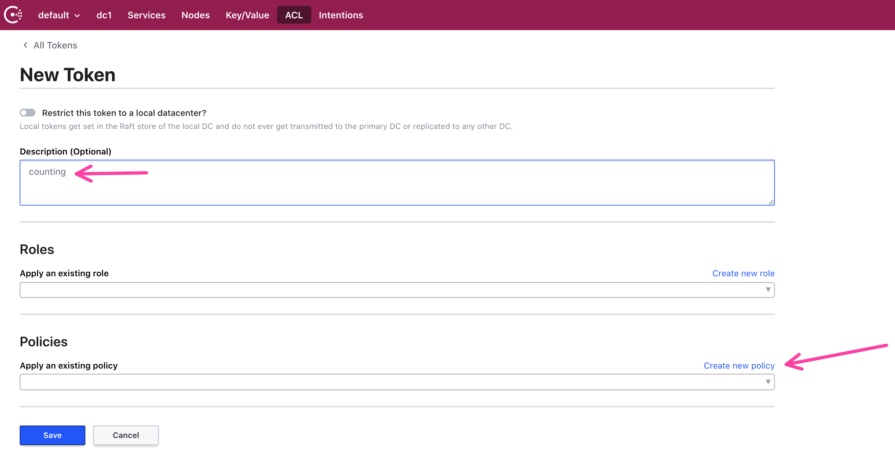

For your new policy, select "Service Identity". This automatically
generates the rules for service registration. Name the policy `counting`
and select "Create and apply"

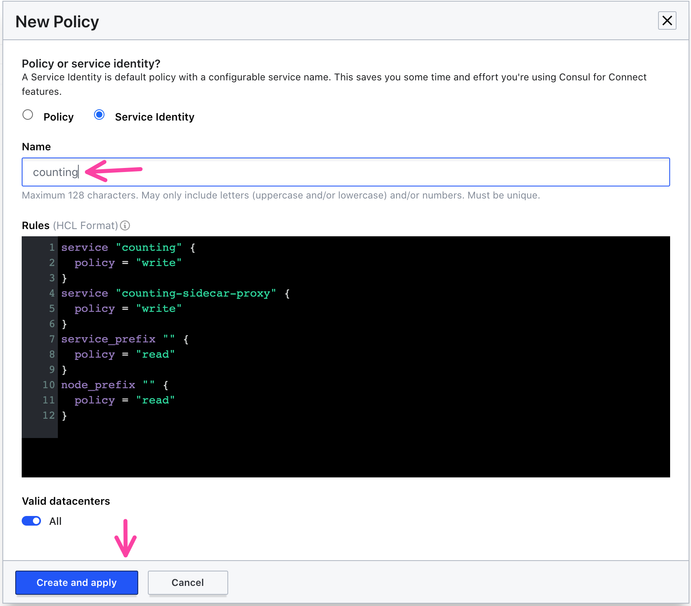

Save the new token. Check you have a new token for the counting service.

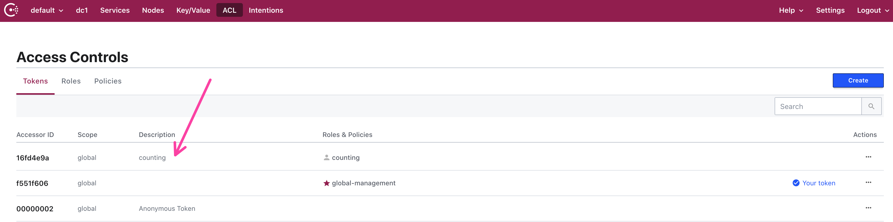

Click the `counting` token name and copy the token.

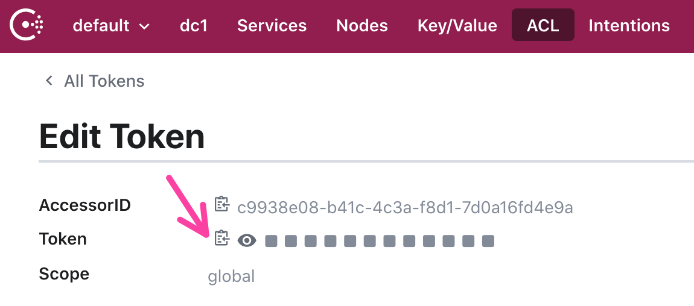

In terminal, set an environment variable `COUNTING_ACL_TOKEN` to
the copied token.

```shell
$ export COUNTING_ACL_TOKEN=<your copied counting ACL token>
```
</Tab>

<Tab heading="Create a Consul ACL token for the dashboard service">

Go to HCP Consul's ACLs and select "Create" for a new token.


Add `dashboard` to the description and select "Create a new policy".

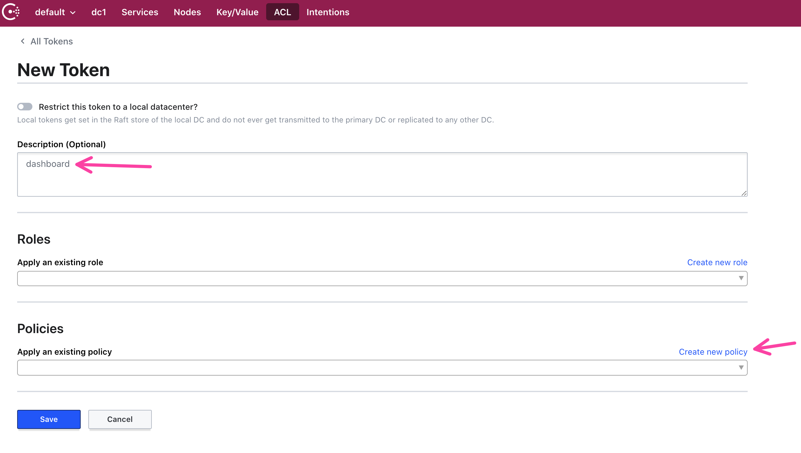

For your new policy, select "Service Identity". This automatically
generates the rules for service registration. Name the policy `dashboard`
and select "Create and apply"

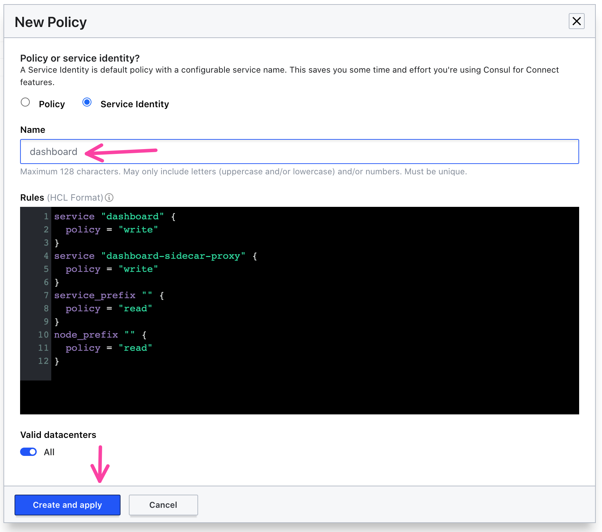

Save the new token. Check you have a new token for the dashboard service.

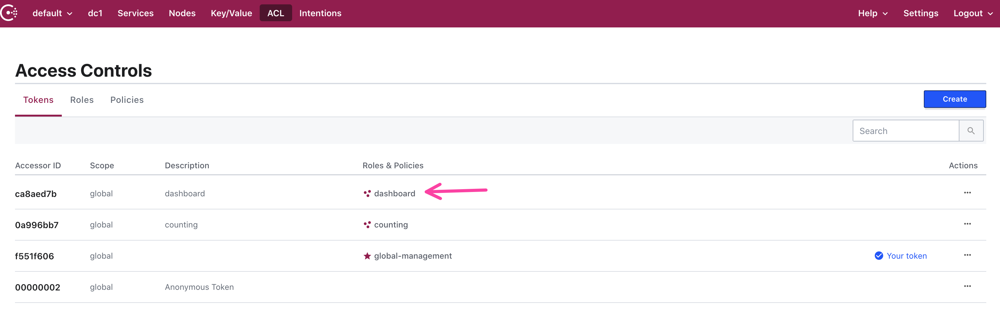

Click the `dashboard` token name and copy the token.


In terminal, set an environment variable `DASHBOARD_ACL_TOKEN` to
the copied token.

```shell
$ export DASHBOARD_ACL_TOKEN=<your copied dashboard ACL token>
```
</Tab>
</Tabs>

## Add the Consul ACL tokens for counting and dashboard to AWS Secrets Manager

Amazon ECS needs access to the ACL tokens as part of the task definition. As a result,
you must store the service's ACL tokens into a secrets manager, in this case AWS
Secrets Manager.

<Tabs>

<Tab heading="Add the counting token to AWS Secrets Manager">

Using the AWS CLI, create a secret called `counting` and set the value
to `${COUNTING_ACL_TOKEN}`.

```shell
$ export COUNTING_SECRET_ARN=$(aws secretsmanager create-secret --name counting \
    --secret-string ${COUNTING_ACL_TOKEN} --query 'ARN' --output text)
```

</Tab>

<Tab heading="Add the dashboard token to AWS Secrets Manager">

Using the AWS CLI, create a secret called `dashboard` and set the value
to `${DASHBOARD_ACL_TOKEN}`.

```shell
$ export DASHBOARD_SECRET_ARN=$(aws secretsmanager create-secret --name dashboard \
    --secret-string ${DASHBOARD_ACL_TOKEN} --query 'ARN' --output text)
```
</Tab>
</Tabs>

## Create the AWS IAM Role for counting and dashboard ECS tasks

In order for Amazon ECS tasks to access AWS Secrets Manager, you must create AWS IAM roles
that allow the task to retrieve a specific secret. This is done with a
[task role](https://docs.aws.amazon.com/AmazonECS/latest/userguide/task-iam-roles.html). Each
service must be configured with a different task role to ensure they cannot access any other the Consul
ACL tokens besides their own.

<Tabs>

<Tab heading="Create an ECS Trusted Entity Policy">

Create a JSON file called `ecs_trusted_entity.json`. This allows the ECS task to
assume a role and access secrets in AWS Secrets Manager.

```shell
$ echo '{
  "Version": "2012-10-17",
  "Statement": [
    {
      "Sid": "",
      "Effect": "Allow",
      "Principal": {
        "Service": "ecs-tasks.amazonaws.com"
      },
      "Action": "sts:AssumeRole"
    }
  ]
}' > ecs_trusted_entity.json
```
</Tab>

<Tab heading="Create an ECS task role for counting">

Create a JSON file called `counting_policy.json` and add the ARN of the `counting` secret
into `${COUNTING_SECRET_ARN}`.

```shell
$ echo '{
  "Version": "2012-10-17",
  "Statement": [
    {
      "Effect": "Allow",
      "Action": [
        "secretsmanager:GetSecretValue",
        "kms:Decrypt"
      ],
      "Resource": [
        "'${COUNTING_SECRET_ARN}'"
      ]
    }
  ]
}' > counting_policy.json
```

Create an AWS IAM role that uses the trusted entity policy in `ecs_trusted_entity.json` and attach
the `counting_policy.json` as an embedded policy.

```shell
$ export COUNTING_ROLE_ARN=$(aws iam create-role --role-name Counting-Service-Role \
    --assume-role-policy-document file://ecs_trusted_entity.json \
    --query 'Role.Arn' --output text)
$ aws iam put-role-policy --role-name Counting-Service-Role \
    --policy-name Counting-Service-Policy --policy-document file://counting_policy.json
```

</Tab>

<Tab heading="Create an ECS task role for dashboard">

Create a JSON file called `dashboard_policy.json` and add the ARN of the `dashboard` secret
into `${DASHBOARD_SECRET_ARN}`.

```shell
$ echo '{
  "Version": "2012-10-17",
  "Statement": [
    {
      "Effect": "Allow",
      "Action": [
        "secretsmanager:GetSecretValue",
        "kms:Decrypt"
      ],
      "Resource": [
        "'${DASHBOARD_SECRET_ARN}'"
      ]
    }
  ]
}' > dashboard_policy.json
```

Create an AWS IAM role that uses the trusted entity policy in `ecs_trusted_entity.json` and attach
the `dashboard_policy.json` as an embedded policy.

```shell
$ export DASHBOARD_ROLE_ARN=$(aws iam create-role --role-name Dashboard-Service-Role \
    --assume-role-policy-document file://ecs_trusted_entity.json \
    --query 'Role.Arn' --output text)
$ aws iam put-role-policy --role-name Dashboard-Service-Role \
    --policy-name Dashboard-Service-Policy --policy-document file://dashboard_policy.json
```

</Tab>
</Tabs>

## Create the ECS Task Definitions for Counting and Dashboard Services

After setting up the secrets and enabling ECS tasks access to read them, you can create the task definitions for
the counting and dashboard services. You must add the role and
secret ARNs to the task definitions for the counting and dashboard services in order to run them properly.

<Tabs>
<Tab heading="Register the Counting ECS Task Definition">

Create a file called `counting_definition.json` with a task definition JSON. It defines two containers, one for the
counting service on port 9001 and another for the counting service's sidecar listening on port 21000. It defines a
few environment variables related to the `consul-ecs` sidecar image, including the mode (`CONSUL_PROXY`), service
name (counting), port (9001), and path for application health check (`/health`). The Consul ACL token for registering
the counting service will be set as the `CONSUL_HTTP_TOKEN` environment variable within the sidecar.

```shell
$ echo '{
    "executionRoleArn": "'${COUNTING_ROLE_ARN}'",
    "containerDefinitions": [
        {
            "portMappings": [
                {
                    "protocol": "tcp",
                    "containerPort": 9001
                }
            ],
            "cpu": 10,
            "memory": 300,
            "image": "hashicorp/counting-service:0.0.2",
            "name": "counting"
        },
        {
            "portMappings": [
                {
                    "protocol": "tcp",
                    "containerPort": 21000
                }
            ],
            "cpu": 10,
            "environment": [
                {
                    "name": "CONSUL_PROXY",
                    "value": "true"
                },
                {
                    "name": "SERVICE_NAME",
                    "value": "counting"
                },
                {
                    "name": "SERVICE_PORT",
                    "value": "9001"
                },
                {
                    "name": "SERVICE_HEALTH_CHECK_PATH",
                    "value": "/health"
                }
            ],
            "secrets": [
                {
                    "valueFrom": "'${COUNTING_SECRET_ARN}'",
                    "name": "CONSUL_HTTP_TOKEN"
                }
            ],
            "memory": 100,
            "image": "joatmon08/consul-ecs:v1.8.4-v1.14.4",
            "name": "counting-sidecar"
        }
    ],
    "taskRoleArn": "'${COUNTING_ROLE_ARN}'",
    "family": "counting",
    "requiresCompatibilities": [
        "EC2"
    ],
    "networkMode": "awsvpc"
}' > counting_definition.json
```

Register the task definition in `counting_definition.json`.

```shell
$ export COUNTING_TASK_DEFINITION_ARN=$(aws ecs register-task-definition --cli-input-json file://counting_definition.json \
    --query 'taskDefinition.taskDefinitionArn' --output text)
```

</Tab>

<Tab heading="Register the Dashboard ECS Task Definition">

Create a file called `dashboard_definition.json` with a task definition JSON. It defines two containers, one for the
dashboard service on port 9002 and another for the counting service's sidecar listening on port 21000. It defines a
few environment variables related to the `consul-ecs` sidecar image, including the mode (`CONSUL_PROXY`), service
name (dashboard), port (9002), and path for application health check (`/health`). The Consul ACL token for registering
the dashboard service will be set as the `CONSUL_HTTP_TOKEN` environment variable within the sidecar.

The main difference between the dashboard and counting is that dashboard accesses the upstream counting service endpoint.
Configure this by specifying the upstream using `CONSUL_SERVICE_UPSTREAMS`. The upstream configuration must be a JSON
blob with no spaces and escaped double quotes.

```shell
$ echo '{
    "executionRoleArn": "'${DASHBOARD_ROLE_ARN}'",
    "containerDefinitions": [
        {
            "portMappings": [
                {
                    "hostPort": 9002,
                    "protocol": "tcp",
                    "containerPort": 9002
                }
            ],
            "cpu": 10,
            "environment": [
                {
                    "name": "COUNTING_SERVICE_URL",
                    "value": "http://localhost:9001"
                }
            ],
            "memory": 300,
            "image": "hashicorp/dashboard-service:0.0.4",
            "name": "dashboard"
        },
        {
            "portMappings": [
                {
                    "hostPort": 21000,
                    "protocol": "tcp",
                    "containerPort": 21000
                }
            ],
            "cpu": 10,
            "environment": [
                {
                    "name": "CONSUL_PROXY",
                    "value": "true"
                },
                {
                    "name": "SERVICE_NAME",
                    "value": "dashboard"
                },
                {
                    "name": "SERVICE_PORT",
                    "value": "9002"
                },
                {
                    "name": "SERVICE_HEALTH_CHECK_PATH",
                    "value": "/health"
                },
                {
                    "name": "CONSUL_SERVICE_UPSTREAMS",
                    "value": "[{\"destination_name\":\"counting\",\"local_bind_port\":9001}]"
                }
            ],
            "secrets": [
                {
                    "valueFrom": "'${DASHBOARD_SECRET_ARN}'",
                    "name": "CONSUL_HTTP_TOKEN"
                }
            ],
            "memory": 100,
            "image": "joatmon08/consul-ecs:v1.8.4-v1.14.4",
            "name": "dashboard-sidecar"
        }
    ],
    "taskRoleArn": "'${DASHBOARD_ROLE_ARN}'",
    "family": "dashboard",
    "requiresCompatibilities": [
        "EC2"
    ],
    "networkMode": "awsvpc"
}' > dashboard_definition.json
```

Register the task definition in `dashboard_definition.json`.

```shell
$ export DASHBOARD_TASK_DEFINITION_ARN=$(aws ecs register-task-definition --cli-input-json file://dashboard_definition.json \
    --query 'taskDefinition.taskDefinitionArn' --output text)
```

</Tab>
</Tabs>

## Deploy the services

You can now deploy the counting and dashboard service to ECS.

<Tabs>

<Tab heading="Get Subnets and Security Groups for ECS Cluster">

Before deploying the counting service, retrieve the VPC ID, subnet IDs, and security group IDs
for your EC2 container instances. You need this information because the counting service runs in `awsvpc` mode,
which means you must specify the networking configuration.

Check that your environment variable `ECS_CLUSTER_NAME` contains the ECS cluster you want to target.

```shell
$ echo $ECS_CLUSTER_NAME
```

Retrieve all of the subnet ids associated with ECS container instances.

```shell
$ export ECS_SUBNET_IDS=$(aws ecs list-attributes --target-type container-instance \
    --attribute-name ecs.subnet-id --cluster ${ECS_CLUSTER_NAME} \
    --query "attributes[*].value" --output json)
$ export ECS_VPC_ID=$(aws ecs list-attributes --target-type container-instance \
    --attribute-name ecs.vpc-id --cluster ${ECS_CLUSTER_NAME} \
    --query "attributes[0].value" --output text)
```

Check that your environment variable `ECS_SECURITY_GROUP_ID` contains the security group
ID for the ECS container instances.

```shell
$ echo $ECS_SECURITY_GROUP_ID
```

</Tab>

<Tab heading="Deploy the Counting Service">
Create one instance of the counting service and add the subnets and security groups related to ECS.

```shell
$ aws ecs create-service \
    --cluster ${ECS_CLUSTER_NAME} \
    --service-name counting \
    --task-definition ${COUNTING_TASK_DEFINITION_ARN} \
    --desired-count 1 \
    --network-configuration "awsvpcConfiguration={subnets=${ECS_SUBNET_IDS},securityGroups=${ECS_SECURITY_GROUP_ID}}"
```

Navigate to the Consul UI. The counting services registers with its proxy. The service resolves to the IP address of the
ECS task because it runs in `awsvpc` mode.

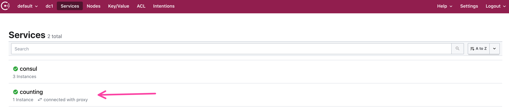
</Tab>

<Tab heading="Create a Load Balancer for Dashboard Service">
Create a security group that will allow inbound requests from your machine to the load balancer. Remove the outbound security group and replace
it with a more restrictive rule that allows outbound requests to the ECS cluster.

```shell
$ export ALB_SECURITY_GROUP_ID=$(aws ec2 create-security-group --group-name dashboard-alb \
    --description "Allow traffic to Dashboard ALB" --vpc-id ${ECS_VPC_ID} \
    --query 'GroupId' --output text)
$ aws ec2 authorize-security-group-ingress --group-id ${ALB_SECURITY_GROUP_ID} \
    --protocol tcp --port 80 --cidr $(curl -s https://checkip.amazonaws.com)/32
$ aws ec2 revoke-security-group-egress --group-id ${ALB_SECURITY_GROUP_ID} \
    --ip-permissions '[{"IpProtocol": "-1", "FromPort": -1, "ToPort": -1,"IpRanges": [{"CidrIp": "0.0.0.0/0"}]}]'
$ aws ec2 authorize-security-group-egress --group-id ${ALB_SECURITY_GROUP_ID} --protocol tcp \
    --port 9002 --cidr $(aws ec2 describe-vpcs --vpc-id ${ECS_VPC_ID} --query 'Vpcs[0].CidrBlock' --output text)
```

Create an application load balancer. This receives requests and forwards them to the dashboard service.

```shell
$ export ALB_ARN=$(aws elbv2 create-load-balancer --name dashboard-alb \
    --subnets ${ECS_SUBNET_IDS} --security-groups ${ALB_SECURITY_GROUP_ID} ${ECS_SECURITY_GROUP_ID} \
    --query 'LoadBalancers[0].LoadBalancerArn' --output text)
```

Create a target group for the dashboard service, which will route traffic to dashboard. 
The `target-type` must be `ip` due to `awsvpc` mode.

```shell
$ export DASHBOARD_TARGET_GROUP_ARN=$(aws elbv2 create-target-group \
    --name dashboard --protocol HTTP --port 9002 \
    --target-type ip --vpc-id ${ECS_VPC_ID} \
    --query 'TargetGroups[0].TargetGroupArn' --output text)
```

Create a listener that forwards traffic to the target group. Make you defined the `${ALB_ARN}` with 
the ARN of the application load balancer.

```shell
$ export LISTENER_ARN=$(aws elbv2 create-listener \
     --load-balancer-arn ${ALB_ARN} \
     --protocol HTTP \
     --port 80 \
     --default-actions Type=forward,TargetGroupArn=${DASHBOARD_TARGET_GROUP_ARN} \
     --query 'Listeners[0].ListenerArn' --output text)
```
</Tab>

<Tab heading="Deploy the Dashboard Service">

Create one instance of the dashboard service and add the subnets and security groups related to ECS.

```shell
$ aws ecs create-service \
    --cluster ${ECS_CLUSTER_NAME} \
    --service-name dashboard \
    --task-definition ${DASHBOARD_TASK_DEFINITION_ARN} \
    --load-balancer targetGroupArn=${DASHBOARD_TARGET_GROUP_ARN},containerName=dashboard,containerPort=9002 \
    --desired-count 1 \
    --network-configuration "awsvpcConfiguration={subnets=${ECS_SUBNET_IDS},securityGroups=${ECS_SECURITY_GROUP_ID}}"
```

Navigate to the Consul UI. The dashboard services registers with its proxy. The service resolves to the IP address of the
ECS task because it runs in `awsvpc` mode.

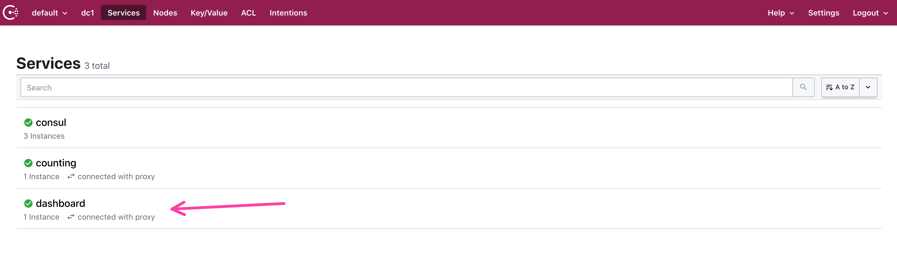

Get the endpoint for your load balancer.

```shell
$ aws elbv2 describe-load-balancers --load-balancer-arns ${ALB_ARN} \
    --query 'LoadBalancers[0].DNSName' --output text
dashboard-alb-1257206425.us-west-2.elb.amazonaws.com
```

> If you get a 504 error when you access the endpoint, this is because the load balancer is still
> creating and attaching the target groups.

If you access the webpage, you will notice that dashboard cannot reach the counting service.

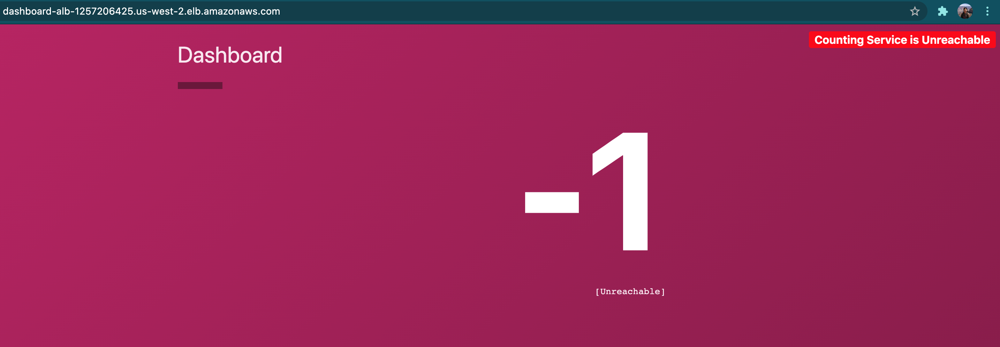
</Tab>
</Tabs>

## Enable service-to-service communication with Consul Intentions

By default, HCP Consul will not allow any service-to-service traffic. You will
need to add an intention to allow dashboard and counting to communicate.

<Tabs>
<Tab heading="Enable intentions">

Go to the Consul UI and click on the "Intentions" page.

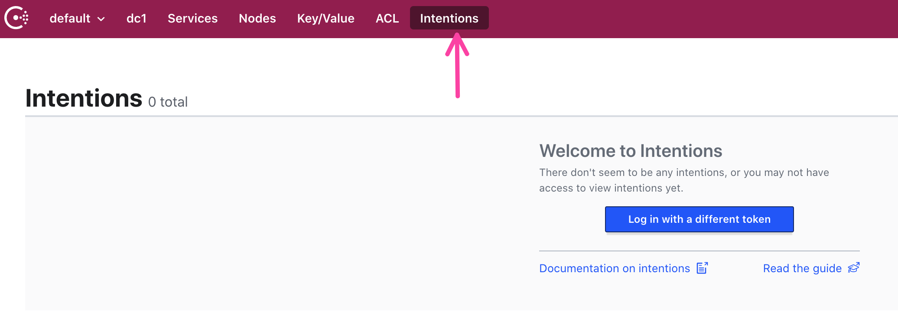

Click "Create" to make a new intention.

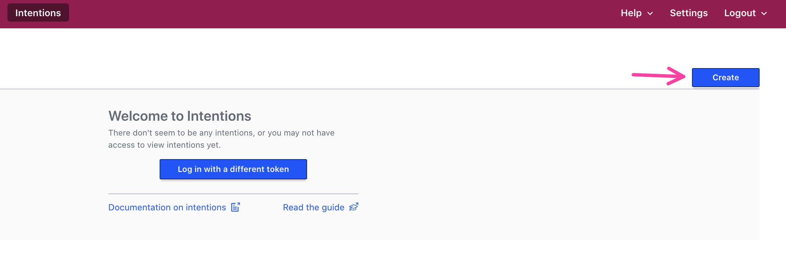

Create a new intention with the source as `dashboard` and the destination
as `counting`. In addition, allow services from the `default` namespace. Select "Allow"
and click "Save".

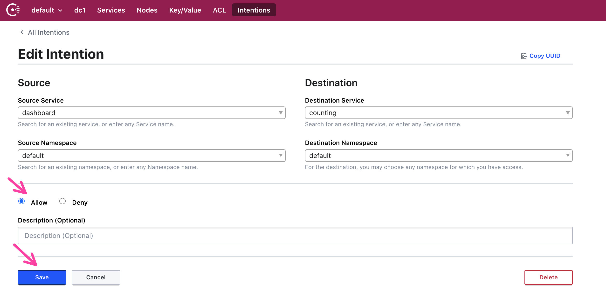

If you return to the DNS name of the ALB displaying the dashboard service, you will see the
service counting up and the status as "Connected".

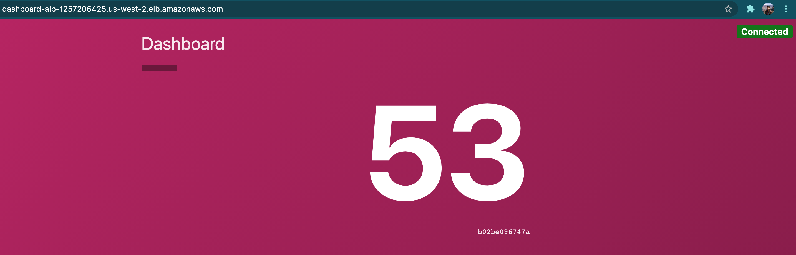

</Tab>
</Tabs>

## Clean Up

Remove the services and definitions from ECS.

<Tabs>
<Tab heading="Delete services from ECS">

Delete the Consul client related components.

```shell
$ aws ecs delete-service --cluster ${ECS_CLUSTER_NAME}  --service dashboard --force
$ aws elbv2 delete-listener --listener-arn ${LISTENER_ARN}
$ aws elbv2 delete-target-group --target-group-arn ${DASHBOARD_TARGET_GROUP_ARN}
$ aws elbv2 delete-load-balancer --load-balancer-arn ${ALB_ARN}
$ aws ec2 delete-security-group --group-id ${ALB_SECURITY_GROUP_ID}
$ aws ecs delete-service --cluster ${ECS_CLUSTER_NAME}  --service counting --force
$ aws iam delete-role-policy --role-name Dashboard-Service-Role --policy-name Dashboard-Service-Policy
$ aws iam delete-role-policy --role-name Counting-Service-Role --policy-name Counting-Service-Policy
$ aws iam delete-role --role-name Dashboard-Service-Role
$ aws iam delete-role --role-name Counting-Service-Role
$ aws secretsmanager delete-secret --secret-id ${DASHBOARD_SECRET_ARN} --force-delete-without-recovery
$ aws secretsmanager delete-secret --secret-id ${COUNTING_SECRET_ARN} --force-delete-without-recovery
$ aws ecs deregister-task-definition --task-definition ${DASHBOARD_TASK_DEFINITION_ARN}
$ aws ecs deregister-task-definition --task-definition ${COUNTING_TASK_DEFINITION_ARN}
```

Delete the Consul client related components.

```shell
$ aws ecs delete-service --cluster ${ECS_CLUSTER_NAME}  --service consul --force
$ aws secretsmanager delete-secret --secret-id ${CONSUL_CLIENT_SECRET_ARN} --force-delete-without-recovery
$ aws iam delete-role-policy --role-name Consul-Client-Role --policy-name Consul-Client-Policy
$ aws iam delete-role --role-name Consul-Client-Role
$ aws ecs deregister-task-definition --task-definition ${CONSUL_CLIENT_TASK_DEFINITION_ARN}
```
</Tab>
</Tabs>

## Additional discussion

After deleting the ECS container instances, you might see former nodes still registered as "unhealthy" in
HCP Consul. This is a known issue with health checking related to containers. We are discussing options/possible
fixes in a future release. In the meantime, HCP Consul will remove these nodes after 72 hours.

You can also use [ecs-cli](https://docs.aws.amazon.com/AmazonECS/latest/developerguide/cmd-ecs-cli.html) to deploy the counting and dashboard services.
However, the task definitions must be converted to proper syntax.

Currently, the Consul clients do not `verify_incoming` requests as part of their TLS configuration because HCP
Consul uses ACLs by default. Further testing will be required in order to enable `verify_incoming` on the
client configuration.

If you would like to see the client and service configuration, the templates reside
in [joatmon08/consul-ecs](https://github.com/joatmon08/consul-ecs).

## Next steps

In this section, you deployed a set of Consul clients to Amazon ECS using EC2 instances. In addition,
you used the counting and dashboard services to explore Consul's service discovery and communication capabilities.