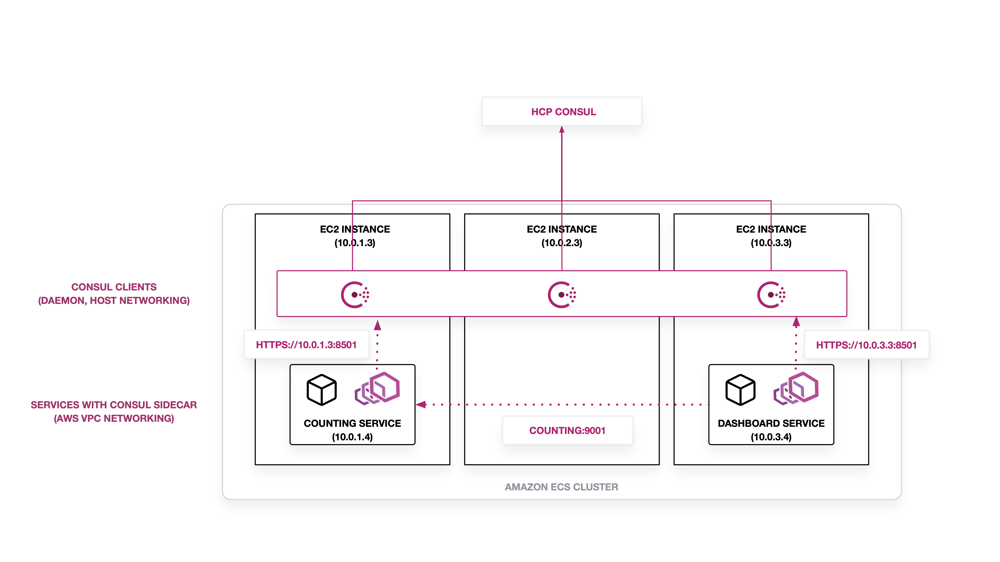
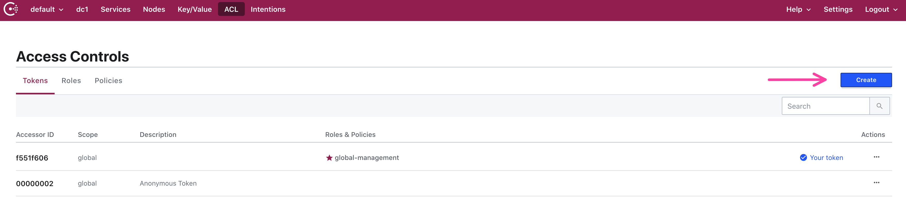
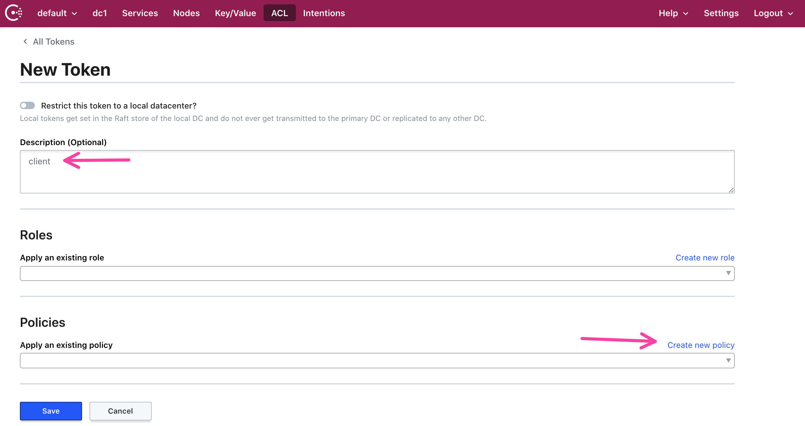
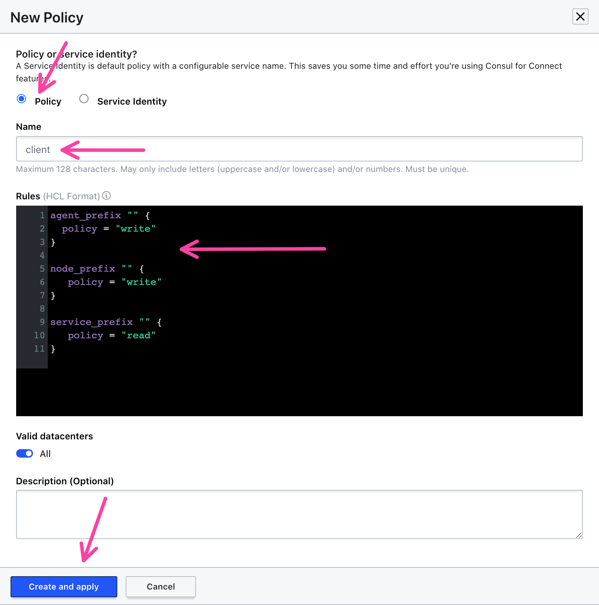
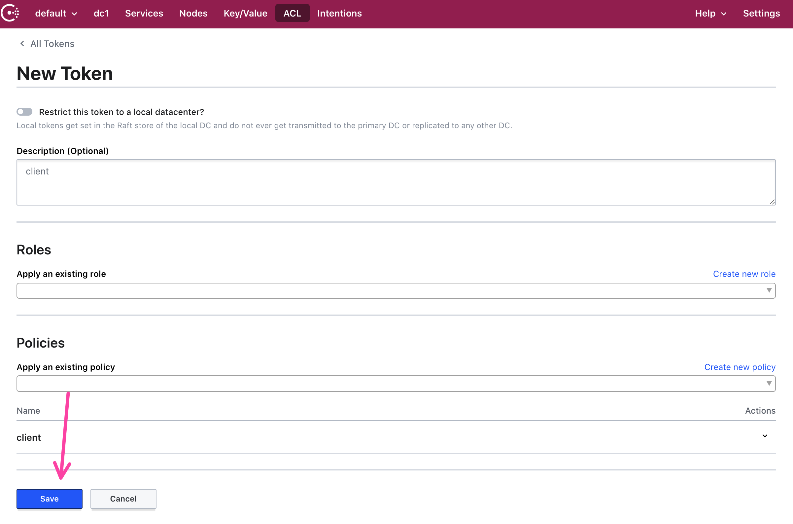
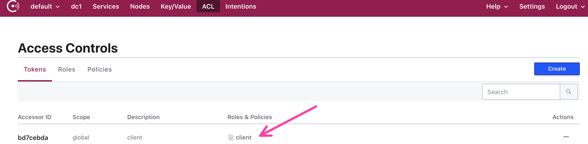
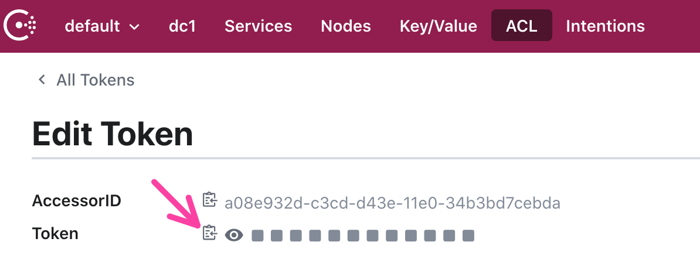
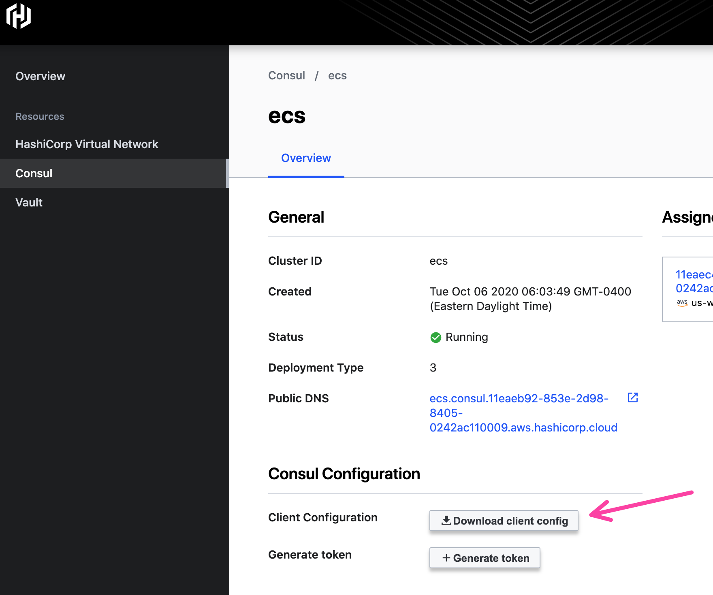
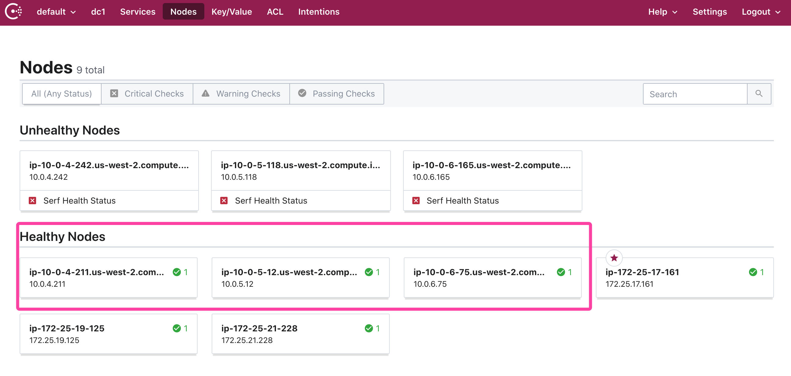

In this tutorial, you will deploy Consul clients to Amazon ECS __using EC2 instances__.

You create the following:

- ECS Task Definition for Consul clients
- IAM Roles for Consul clients
- Secrets in AWS Secrets Manager for Consul clients
- ECS Service for Consul clients



## Prerequisites

- You have knowledge of:
  - ECS task definitions
  - Autoscaling groups

- [jq](https://stedolan.github.io/jq/download/)

- [AWS CLI, version 2](https://docs.aws.amazon.com/cli/latest/userguide/install-cliv2.html). Set the region to `us-west-2`.
  ```shell
  $ export AWS_REGION=us-west-2
  ```

- [Hashicorp Virtual Network](https://deploy-preview-1720--hashicorp-learn.netlify.app/consul/hcp/deploy)

- A public HCP Consul Cluster in `us-west-2`, so you can access the Consul UI.

- An Amazon ECS cluster using EC2 instances in `us-west-2`.

  - Set this as `ECS_CLUSTER_NAME`.
    ```shell
    $ export ECS_CLUSTER_NAME=<your ecs cluster name>
    ```

  - Container instances can be private or public.

  - ECS Container instances must be able to use 
    [`awsvpc` mode](https://docs.aws.amazon.com/AmazonECS/latest/developerguide/task-networking.html)
    and [AWS Secrets Manager](https://docs.aws.amazon.com/AmazonECS/latest/developerguide/specifying-sensitive-data-secrets.html).
    The following cluster attributes must be set in user data:
    ```shell
    ECS_ENABLE_AWSLOGS_EXECUTIONROLE_OVERRIDE=true
    ECS_ENABLE_TASK_ENI=true
    ECS_CLUSTER=${ECS_CLUSTER_NAME}
    ```

  - You can use [Terraform to create the cluster](./cluster) or [ecs-cli](https://docs.aws.amazon.com/AmazonECS/latest/developerguide/cmd-ecs-cli.html).

- Peering connection accepted between the ECS cluster and HCP Consul.

- Security group rules to allow communication between ECS cluster and HCP Consul
  and within the ECS cluster.

## Check the ECS security group

Your ECS container instances must have specific rules to allow access to Consul and its proxies access
to Consul clients.

<Tabs>
<Tab heading="Set the ECS security group">

Get the ID of the security group associated with the ECS container instances. Set that to
the `ECS_SECURITY_GROUP_ID` environment variable.

```shell
$ export ECS_SECURITY_GROUP_ID=<security group associated with ECS container instances>
```

</Tab>
<Tab heading="Check the ECS security group">

Check that your security group has the following rules to allow LAN, Serf, RPC, HTTPS,
and GRPC.

```shell
$ aws ec2 describe-security-groups --output text --group-ids ${ECS_SECURITY_GROUP_ID}
IPPERMISSIONS   80      udp     80
IPRANGES        172.25.16.0/20  Consul HTTP
IPPERMISSIONS   8300    tcp     8300
IPRANGES        172.25.16.0/20  HCP Consul Server RPC
IPPERMISSIONS   0       tcp     65535
USERIDGROUPPAIRS        Allow all TCP traffic between ECS container instances   ${ECS_SECURITY_GROUP_ID}
IPPERMISSIONS   8301    udp     8301
IPRANGES        172.25.16.0/20  Consul LAN Serf (udp)
IPPERMISSIONS   443     udp     443
IPRANGES        172.25.16.0/20  Consul HTTPS
IPPERMISSIONS   8301    tcp     8301
IPRANGES        172.25.16.0/20  Consul LAN Serf (tcp)
```

In general:

- You will need ports 80, 443, and 8301 with UDP access to HCP Consul (CIDR block).
- You will need ports 8300 and 8301 with TCP access to HCP Consul (CIDR block).
- You will need to allow all TCP traffic between ECS container instances. Use the ECS security
  group ID as the source group identifier.

</Tab>
</Tabs>

## Create Consul Client ACL Token

In order to limit the privileges a Consul client has to HCP Consul, create an individual
token for the Consul clients to register and communicate with the server.

<Tabs>
<Tab heading="Create a Consul ACL token for the clients">

Go to HCP Consul's ACLs and select "Create" for a new token.



Add `client` to the description and select "Create a new policy".



Create the client policy by naming it "client" and adding a rule
to allow write from any nodes and agents and reading for any services.
Click "Create and apply".



Save the policy and generate the token.



You will now have the "client" token in the tokens view.



Copy the client token.



Set it to the `CONSUL_HTTP_TOKEN` environment variable.

```shell
$ export CONSUL_HTTP_TOKEN=<insert client token>
```

</Tab>
</Tabs>

## Add Consul configuration to AWS Secrets Manager.

In order for the ECS container instances to properly use Consul, they need to be able to
access the Consul servers on HCP Consul. These include three parameters:

- The certificate authority for Consul servers in `ca.pem`
- Gossip encryption key, for securing communication between servers and clients
- Client ACL Token to register Consul clients, saved in the `CONSUL_HTTP_TOKEN`
  environment variable.

<Tabs>
<Tab heading="Retrieve the client configuration">

Go into HCP Consul and download the client config to your current working
directory.



Unzip the client configuration. You will have a `ca.pem` file and an example
`client_config.json`.

```shell
$  unzip client_config_bundle_consul_ecs.zip
Archive:  client_config_bundle_consul_ecs.zip
  inflating: client_config.json      
  inflating: ca.pem   
```

Base64 encode the `ca.pem` file into an environment variable called `CONSUL_CA_PEM`.
This escapes problems with newlines and whitespaces.

```shell
$ export CONSUL_CA_PEM=$(cat ca.pem | base64)
```

Extract the gossip encryption key and the server hostname out of the client configuration.

```shell
$ export CONSUL_GOSSIP_ENCRYPT=$(jq -r '.encrypt' client_config.json)
$ export CONSUL_HTTP_ADDR=$(jq -r '.retry_join[0]' client_config.json)
```

</Tab>

<Tab heading="Add the Consul configuration to AWS Secrets Manager">

Create a JSON file called `client_secret.json` for the Consul certificate authority,
gossip encrypt key, server endpoint, and token.

```shell
$ echo '{
    "retry_join": "'${CONSUL_HTTP_ADDR}'",
    "token": "'${CONSUL_HTTP_TOKEN}'",
    "certificate": "'${CONSUL_CA_PEM}'",
    "encrypt_key": "'${CONSUL_GOSSIP_ENCRYPT}'"
}' > client_secret.json
```

Using the AWS CLI, create a secret called `consul` and set the value
to read from `client_secret.json`. Save the ARN of the secret into
`CONSUL_CLIENT_SECRET_ARN`.

```shell
$ export CONSUL_CLIENT_SECRET_ARN=$(aws secretsmanager create-secret --name consul \
    --secret-string file://client_secret.json --query 'ARN' --output text)
```

</Tab>
</Tabs>

## Create the AWS IAM Role for Consul client ECS tasks

In order for Amazon ECS tasks to access AWS Secrets Manager, you must create AWS IAM roles
that allow the task to retrieve a specific secret. This is done with a
[task role](https://docs.aws.amazon.com/AmazonECS/latest/userguide/task-iam-roles.html). The client
must use a task role to ensure they cannot access any other secrets besides the client secret.

<Tabs>

<Tab heading="Create an ECS Trusted Entity Policy">

Create a JSON file called `ecs_trusted_entity.json`. This allows the ECS task to
assume a role and access secrets in AWS Secrets Manager.

```shell
$ echo '{
  "Version": "2012-10-17",
  "Statement": [
    {
      "Sid": "",
      "Effect": "Allow",
      "Principal": {
        "Service": "ecs-tasks.amazonaws.com"
      },
      "Action": "sts:AssumeRole"
    }
  ]
}' > ecs_trusted_entity.json
```

</Tab>

<Tab heading="Create an ECS Task Role for Consul Clients">

Create a JSON file called `client_policy.json` and add the ARN of the `consul` secret
into `${CONSUL_CLIENT_SECRET_ARN}`.

```shell
$ echo '{
  "Version": "2012-10-17",
  "Statement": [
    {
      "Effect": "Allow",
      "Action": [
        "secretsmanager:GetSecretValue",
        "kms:Decrypt"
      ],
      "Resource": [
        "'${CONSUL_CLIENT_SECRET_ARN}'"
      ]
    }
  ]
}' > client_policy.json
```

Create an AWS IAM role that uses the trusted entity policy in `ecs_trusted_entity.json` and attach
the `client_policy.json` as an embedded policy.

```shell
$ export CONSUL_CLIENT_ROLE_ARN=$(aws iam create-role --role-name Consul-Client-Role \
    --assume-role-policy-document file://ecs_trusted_entity.json \
    --query 'Role.Arn' --output text)
$ aws iam put-role-policy --role-name Consul-Client-Role \
    --policy-name Consul-Client-Policy --policy-document file://client_policy.json
```

</Tab>

</Tabs>

## Create the ECS Task Definition for Consul Client

After setting up the secrets and enabling ECS tasks access to read them, you can create the task definitions
for Consul clients. You must add the role and secret ARNs to the task definitions for the Consul clients
to run properly.

<Tabs>
<Tab heading="Register the Consul Client ECS Task Definition">

Create a file called `consul_definition.json` with a task definition JSON. It defines one container for the Consul
client and a few environment variables to run in client mode. Note the client runs in host networking mode so it can be
deployed as one per ECS container instance. The Consul ACL token for registering client will be set as the `CONSUL_HTTP_TOKEN`
environment variable within the sidecar.

```shell
$ echo '{
  "executionRoleArn": "'${CONSUL_CLIENT_ROLE_ARN}'",
  "containerDefinitions": [
    {
      "portMappings": [
        {
          "hostPort": 8301,
          "protocol": "tcp",
          "containerPort": 8301
        },
        {
          "hostPort": 8301,
          "protocol": "udp",
          "containerPort": 8301
        },
        {
          "hostPort": 8302,
          "protocol": "tcp",
          "containerPort": 8302
        },
        {
          "hostPort": 8300,
          "protocol": "tcp",
          "containerPort": 8300
        },
        {
          "hostPort": 8600,
          "protocol": "tcp",
          "containerPort": 8600
        },
        {
          "hostPort": 8600,
          "protocol": "udp",
          "containerPort": 8600
        },
        {
          "hostPort": 8501,
          "protocol": "tcp",
          "containerPort": 8501
        },
        {
          "hostPort": 8502,
          "protocol": "tcp",
          "containerPort": 8502
        }
      ],
      "cpu": 10,
      "environment": [
        {
          "name": "CONSUL_CLIENT",
          "value": "true"
        }
      ],
      "secrets": [
        {
          "valueFrom": "'${CONSUL_CLIENT_SECRET_ARN}':retry_join::",
          "name": "CONSUL_HTTP_ADDR"
        },
        {
          "valueFrom": "'${CONSUL_CLIENT_SECRET_ARN}':token::",
          "name": "CONSUL_HTTP_TOKEN"
        },
        {
          "valueFrom": "'${CONSUL_CLIENT_SECRET_ARN}':certificate::",
          "name": "CONSUL_CA_PEM"
        },
        {
          "valueFrom": "'${CONSUL_CLIENT_SECRET_ARN}':encrypt_key::",
          "name": "CONSUL_GOSSIP_ENCRYPT"
        }
      ],
      "memory": 100,
      "image": "joatmon08/consul-ecs:v1.8.4-v1.14.4",
      "name": "consul-client"
    }
  ],
  "taskRoleArn": "'${CONSUL_CLIENT_ROLE_ARN}'",
  "family": "consul-client",
  "requiresCompatibilities": [
    "EC2"
  ],
  "networkMode": "host"
}' > consul_definition.json
```

Register the task definition in `consul_definition.json`.

```shell
$ export CONSUL_CLIENT_TASK_DEFINITION_ARN=$(aws ecs register-task-definition \
    --cli-input-json file://consul_definition.json \
    --query 'taskDefinition.taskDefinitionArn' --output text)
```

</Tab>
</Tabs>

## Deploy the Consul client

You can now deploy the Consul clients to ECS.

<Tabs>

<Tab heading="Deploy the Consul client">
Deploy the Consul client with the `DAEMON` scheduling strategy. This will
deploy one Consul client per ECS container host in the cluster.

```shell
$ aws ecs create-service \
    --cluster ${ECS_CLUSTER_NAME} \
    --service-name consul \
    --task-definition ${CONSUL_CLIENT_TASK_DEFINITION_ARN} \
    --scheduling-strategy DAEMON
```

Navigate to the Consul UI. The nodes register with Consul.


</Tab>

</Tabs>

## Clean Up

Remove the services and definitions from ECS.

<Tabs>
<Tab heading="Delete Consul Client from ECS">

Delete the Consul client related components.

```shell
$ aws ecs delete-service --cluster ${ECS_CLUSTER_NAME}  --service consul --force
$ aws secretsmanager delete-secret --secret-id ${CONSUL_CLIENT_SECRET_ARN} --force-delete-without-recovery
$ aws iam delete-role-policy --role-name Consul-Client-Role --policy-name Consul-Client-Policy
$ aws iam delete-role --role-name Consul-Client-Role
$ aws ecs deregister-task-definition --task-definition ${CONSUL_CLIENT_TASK_DEFINITION_ARN}
```
</Tab>
</Tabs>

## Additional discussion

After deleting the ECS container instances, you might see former nodes still registered as "unhealthy" in
HCP Consul. This is a known issue with health checking related to containers. We are discussing options/possible
fixes in a future release. In the meantime, HCP Consul will remove these nodes after 72 hours.

You can also use [ecs-cli](https://docs.aws.amazon.com/AmazonECS/latest/developerguide/cmd-ecs-cli.html) to deploy the Consul clients.
However, the task definitions must be converted to proper syntax.

Currently, the Consul clients do not `verify_incoming` requests as part of their TLS configuration because HCP
Consul uses ACLs by default. Further testing will be required in order to enable `verify_incoming` on the
client configuration.

If you would like to see the client and service configuration, the templates reside
in [joatmon08/consul-ecs](https://github.com/joatmon08/consul-ecs).

## Next steps

In this section, you deployed a set of Consul clients to Amazon ECS using EC2 instances. Next, you can [deploy a service to use Consul's service networking
capabilities](ec2-02-services.md).